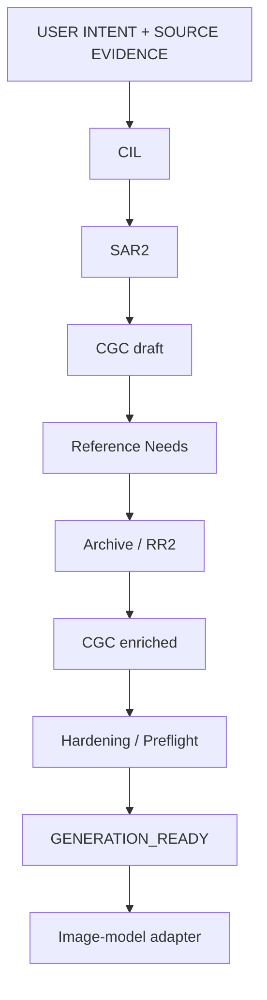

# Streetcraft

Streetcraft turns visual intent and reference evidence into a controlled generation specification. It is designed especially for urban scenes and architecture: reinterpret an image while preserving the identity, geometry and meaning that make it that particular place.

**Current release: SVS 1.10.0 STABLE · one Streetcraft client.**

## What Streetcraft is

Streetcraft is a visual system and orchestrator, not a generative image model, a single prompt or a collection of styles. Free-form generation leaves many decisions to an image model. Streetcraft makes those decisions explicit first: what must survive, what may change, what evidence can help, and what must remain unknown.

Its governing principle is **preservation over invention when evidence exists**. A visual profile can change authorized presentation; it cannot silently replace a building, invent unreadable signage or reconstruct an occluded facade as if it had been observed.

## Core principles

- **Source Authority / Identity Lock:** source invariants govern identity; references and profiles cannot override them.
- **Geometry preservation:** protect proportions, layout and important relationships between scene elements.
- **Semantic Text Lock:** preserve supported wording; mask uncertain text instead of inventing it.
- **Occlusion / `LOCKED_UNKNOWN`:** a hidden region remains unknown when reconstruction is not authorized.
- **Reference Isolation / geographic isolation:** borrow only admitted evidence for a specific need. Fear City retains its authored world rather than importing another city's identity.
- **Atmosphere / Material Carryover Guard:** rain, grime, lighting or surface treatments in a reference are not automatic transformation instructions.
- **Explicit uncertainty and provenance:** distinguish observation from inference and retain the evidence, decisions and hashes behind the contract.

## How it works



Commands establish the requested transformation. Scene analysis identifies protected elements and evidence gaps. Reference reasoning admits only relevant, permitted evidence. Preflight checks the resulting contract before handoff. Missing required evidence, contradictions or prohibited changes can instead produce an explicit block or review request.

**`GENERATION_READY` is the Core's handoff boundary.** It means the contract passed the implemented gates, not that an image has been generated or that its visual quality is guaranteed. The image-model adapter can live outside the central runtime; the orchestrator does not call an image vendor.

## Architecture

The names below follow the current code and contracts.

| Component | Responsibility |
| --- | --- |
| **CIL — Command Invocation Layer** | Expands user commands into mode, profile, camera and preservation settings. |
| **SAR2 — Scene Analysis Record V2** | Records scene entities, relationships, authority, salience, actions and reference gaps. |
| **CGC — Compact Generation Contract** | Expresses what to preserve, transform, remove, infer, leave unknown and forbid. |
| **RR2 — Reference Reasoning 2.0** | Prioritizes needs, budgets queries, checks evidence and enriches the CGC without weakening its locks. |
| **Archive** | Supplies classified documentary evidence and retrieval bundles; it remains separate from Canon authority. |
| **Hardening / Preflight** | Checks text, reference transfer, geography and material/atmosphere constraints before generation. |

The stable implementation is [the unified orchestrator](integration/streetcraft_orchestrator.py). Its Python input contains structured scene evidence; it does not independently turn arbitrary image pixels into a scene analysis.

## Archive-aware reasoning

A **reference need** states a specific unresolved problem. RR2 prioritizes required needs over optional support, respects a query budget and reuses identical requests within one execution. It deduplicates evidence IDs and matching content fingerprints, enforces provenance requirements and retains structured contradictions for review.

Evidence bundles and traces retain admitted/rejected evidence, reasons, bundle IDs and input provenance. Only permitted learning reaches the generation contract. A material reference may explain matte brick behavior without contributing its facade layout or shop name. This separation prevents Archive from contaminating source identity.

The [real catalog](reference_runtime/real_catalog/README.md) contains 10 classified Evidence Units. The external `STREETCRAFT_ARCHIVE_V1_FINAL` runtime is required for real retrieval; recorded identity hashes and validation results are included here.

## Preservation model

```text
Source evidence → Authority → Locks / constraints
               → Allowed transformation → Generation contract
```

**Preserved** elements must retain identity. **Transformable** elements may change within explicit authorization. **Unknown** elements carry uncertainty forward. **Prohibited inference** rules prevent plausible-looking details from being promoted to observed facts. See the [preservation model](core/PRESERVATION_MODEL.md).

## Camera and visual grammar

Profiles are VP00 Streetcraft Core, VP01 RDR Classic, VP02 RDR 2.0 and VP03 Fear City. Camera grammars include frontal-oblique CG-A, street-level oblique CG-B, strict elevation CG-F, source-locked CG-S and authored-view CG-FC. Their use depends on source authority and the requested transformation.

Start with the [Cheat Sheet](CHEAT_SHEET.md); consult [visual profiles](transform/VISUAL_PROFILES.md) and [camera routing](transform/AUTO_ROUTING.md) for the full rules.

## Using Streetcraft

1. Supply a source image/reference and a Streetcraft command or visual intent.
2. The host interprets the source into structured scene evidence; Streetcraft resolves the requested transformation and what must be preserved.
3. Streetcraft identifies additional evidence needs, consults Archive when appropriate and constructs the CGC.
4. Preflight either returns `GENERATION_READY` or explains why handoff is blocked or requires review.
5. An image-model adapter translates the approved contract into generation instructions and produces the image.

These are existing CIL commands used with source evidence, not shell commands:

| Command | Request |
| --- | --- |
| `/sc-core /sc-lock /sc-preserve /sc-noinvent` | Core profile with source-locked camera, strict observed-evidence preservation and unknown preservation. |
| `/sc-rdr2-elevation` | VP02 + T02 + CG-F: strict frontal elevation, identity and occlusion locks, 16:9 and minimal street. |
| `/sc-fear` | T06 + VP03 + CG-FC for confirmed Fear City sources, preserving authored geometry and identity. |

For executable JSON orchestration, use [run_streetcraft_orchestration.py](integration/run_streetcraft_orchestration.py) with `--archive-root`, `--evidence`, `--request` and `--output`. Existing [E2E requests](validation/cgc_e2e/requests/) show the input structure. Runtime and validation setup is documented in [repository verification](docs/repository/VERIFICATION.md).

## Example: controlled reinterpretation

```text
Facade source + /sc-rdr2-elevation
    → Streetcraft resolves identity, text and occlusion constraints
    → CGC requests a strict frontal elevation within those constraints
    → preflight → GENERATION_READY → image-model adapter → OUTPUT
```

Frontalization does not authorize invented lettering or hidden architectural details. The output still needs visual evaluation against the source and contract.

## Validation

The [final release gate](validation/RELEASE_GATE_1_10_0_FINAL.json) records:

| Validation | Recorded result |
| --- | --- |
| [R2b visual benchmark](validation/R2B_1_9_1_FINAL_2026_09_21.json) | 6/6 PASS · score 91.0 · S3=0 |
| RR2 unit tests / orchestrator tests | 18/18 PASS / 10/10 PASS |
| [RR2 real Archive cases](validation/RR2_REAL_ARCHIVE_VALIDATION_V1.json) | 8/8 PASS |
| [CGC real Archive E2E](validation/CGC_END_TO_END_REAL_ARCHIVE_V1.json) | 8/8 PASS |
| [VSG-0.5 diagnostic benchmark](validation/VSG_0_5_DIAGNOSTIC_BENCHMARK.json) | 13/13 PASS · controlled causal localization |
| [VSG-1 Graph Locks](validation/VSG_1_GRAPH_LOCKS_QA.json) | 25/25 PASS · four lock families · validate-only |
| [Unified regression](validation/gate4_2026_09_21/final_regression_after_promotion.json) | PASS |
| Visual evidence / Archive identity | 14/14 evidence SHA matches / 20/20 recorded module SHA matches |

These are release results, not a claim that every environment has rerun external Archive or generated new benchmark images. The [cleanup report](docs/repository/REPOSITORY_CLEANUP_REPORT.md) distinguishes fresh checks from preserved release evidence.

## Repository map

```text
streetcraft/
├── STREETCRAFT.md       # Agent entry point and authority hierarchy
├── core/               # Identity, preservation and visual grammar
├── command_invocation/ # CIL commands and resolver
├── scene_intelligence/ # SAR2 and scene-to-contract projection
├── visual_scene_graph/ # Passive VSG-0 observer and functional subgraphs
│   └── diagnostic_benchmark/ # VSG-0.5 causal fault-injection benchmark
├── integration/        # Single-client orchestration
├── reference_runtime/  # RR2, Archive adapter and real catalog
├── reference/          # Canon governance and reference assets
├── transform/          # Modes, profiles and camera routing
├── hardening/          # Contract and preservation checks
├── patch/              # Active 1.9.1 protections inherited by 1.10
├── adapters/           # Image-model adapter boundary
├── schemas/            # Public data contracts
├── benchmark/          # Baselines, fixtures and R2b evidence
├── validation/         # Runners, release gates, traces and provenance
└── docs/repository/    # Inventory, cleanup audit and verification
```

## Documentation

[Cheat Sheet](CHEAT_SHEET.md) · [Architecture and agent entry](STREETCRAFT.md) · [Reference Reasoning](reference_runtime/REFERENCE_REASONING_2.md) · [Archive integration](REFERENCE_REASONING_ARCHIVE_INTEGRATION.md) · [Validation gate](validation/RELEASE_GATE_1_10_0_FINAL.md) · [Roadmap](ROADMAP.md) · [Changelog](CHANGELOG.md)

## Current release

**SVS 1.10.0 STABLE** integrates Archive-aware reference reasoning and CGC end-to-end orchestration into one Streetcraft client, with the existing preservation and hardening controls. See [release notes](RELEASE_NOTES_1_10_0.md).

## Project status

The **21/9 stable roadmap is complete**. The next authorized work runs as two
decoupled tracks over that stable base: Build Kit and Visual Scene Graph. VSG-0
is a non-governing observer; it does not change generation behavior. Historical
release notes and earlier manifests remain as audit evidence; they do not define
the current release.
